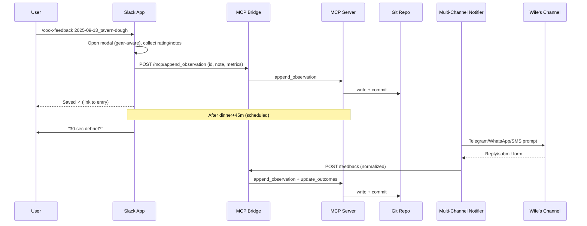

# SPEC.md — Slack + Multi‑Channel Feedback Integration for MCP Lab Notebook
**Version:** 1.0.0  
**Date:** 2025-09-15 14:40 CDT  
**Owner:** Tom Jordan  
**Target Runtime:** Local (dev via stdio), Remote (SSE over HTTPS)  
**Primary Consumer:** MCP‑capable host (Claude Desktop / Claude Code) controlling a **Lab Notebook MCP Server**

---


## 0. Purpose
Deliver a production‑ready integration that:
1) Prompts for **post‑cook feedback** in Slack and (optionally) your wife's **preferred messaging channel**,  
2) Normalizes responses, and  
3) Writes them to the **Git‑backed lab notebook** via the MCP server tools (`append_observation`, `update_outcomes`, etc.).

The integration preserves your **house style**: grams‑first, 6:00 pm dinner target, make‑ahead bias, storage/reuse notes, Recteq/Zojirushi/Matador awareness.

---

## 1. Success Criteria
- **S1** — You can run `/cook-feedback <entry-id>` in Slack and submit a modal; the result is committed to the notebook.
- **S2** — A **scheduled** DM/notification fires (e.g., dinner+45m) asking for a 30‑second debrief.
- **S3** — Your wife receives the prompt on **her channel** (Telegram/WhatsApp/SMS/Signal/email) and her reply lands in the notebook.
- **S4** — All writes are **idempotent**, **authenticated**, and leave a **Git commit** trail with author and message.
- **S5** — You can **export** a postmortem summary (Markdown/PDF) containing feedback and “fixes_next_time”.

---

## 2. Non‑Goals
- Real‑time passive monitoring; no background agents beyond scheduled messages.
- Multi‑tenant access control (single household users assumed).
- Editing notebook content directly in Slack threads (beyond structured feedback fields).

---

## 3. Architecture (Components)
- **A. MCP Server (“Lab Notebook”)** — Implements resources (read) and tools (write) over the Git repo.
- **B. MCP Bridge (REST shim)** — Minimal HTTP façade over MCP tools for non‑MCP clients (Slack, inbound SMS, etc.).
- **C. Slack App** — Bolt (Python/JS) app exposing `/cook-feedback`, interactivity (modals), scheduled messages.
- **D. Multi‑Channel Notifier** — Small Flask service with `/notify` to send via Telegram/WhatsApp/SMS/Signal/email.
- **E. Optional Feedback Web Form** — Single page form `GET /f/:entry_id`, `POST /feedback`, good for non‑Slack users.
- **F. Storage** — Git repo (`notebook/entries/*.md`, `attachments/`), plus optional `.notebook-index.json` cache.
- **G. ICS Generator** — Optional (`synthesize_ics`) to produce cooking timelines and reminders.

### 3.1 High‑Level Sequence (Mermaid)


---

## 4. Data Contracts

### 4.1 Notebook Entry (YAML Front‑Matter + Markdown)
```yaml
id: 2025-09-13_tavern-dough
title: Tavern-Style Pizza Dough — Zoji + Pellet Bake
date: 2025-09-13T10:45:00-05:00
tags: [pizza, zoji, tavern, research]
gear: ["Recteq Bullseye Deluxe", "Zojirushi Virtuoso"]
servings: 4
dinner_time: 2025-09-13T18:00:00-05:00
style_guidelines:
  grams_first: true
  kenji_roy_choi_energy: true
  make_ahead_bias: true
  safe_storage_and_reuse: true

ingredients_g:
  - item: Bread flour
    grams: 800
  - item: Fine cornmeal
    grams: 80
  - item: Water (20–21°C)
    grams: 580
  - item: Salt
    grams: 16
  - item: Instant yeast
    grams: 6
  - item: Oil (neutral)
    grams: 20

protocol: |
  1) Zoji to shaggy, rest, finish knead...
  ...

observations:
  - at: 2025-09-13T12:10:00-05:00
    grill_temp_c: 260
    note: Preheat steel 45 min.

outcomes:
  rating_10: 8
  issues: ["knead load too high for Zoji"]
  fixes_next_time: ["cap flour at ~800g + 80g cornmeal (~1450g dough)"]

scheduling:
  make_ahead:
    day_before: ["sauce", "cold ferment"]
    same_day: ["preheat", "stretch/launch"]
  timeline_ics: true

links:
  - label: Photos
    href: attachments/2025-09-13_tavern-dough/
```

### 4.2 Feedback Note (Normalized JSON)
```json
{
  "entry_id": "2025-09-13_tavern-dough",
  "who": "U02AAA... (slack) or +1555... (sms)",
  "rating_10": 8,
  "axes": {
    "doneness": "spot",
    "salt": "ok",
    "smoke": "just_right",
    "crust": "crackly"
  },
  "metrics": {
    "internal_temp_c": 65,
    "rest_minutes": 12
  },
  "notes": "Great flavor; crust slightly soft at center."
}
```

---

## 5. MCP Contracts (Resources & Tools)

### 5.1 Resources (read)
- `lab://entries` → index list (id, title, date, tags)
- `lab://entry/{id}` → full Markdown entry
- `lab://attachments/{id}/` → attachment listing
- `lab://search?q=…` → `{ hits: [ {id, title, score} ] }`

### 5.2 Tools (write)
**append_observation**
```json
{ "id": "string", "note": "string", "time": "ISO8601?", "grill_temp_c": "number?", "internal_temp_c": "number?" }
```
**update_outcomes**
```json
{ "id": "string", "outcomes": { "rating_10": "number?", "issues": "string[]?", "fixes_next_time": "string[]?" } }
```
**create_entry** (optional for ad-hoc logs)
```json
{ "title": "string", "tags": ["string"], "gear": ["string"], "dinner_time": "ISO8601?" }
```
**git_commit** (optional explicit commit)
```json
{ "message": "string", "auto_add_all": true }
```
**synthesize_ics** (optional)
```json
{ "id": "string", "lead_minutes": 30 }
```

---

## 6. MCP Bridge (HTTP façade)

### 6.1 Endpoints
- `POST /mcp/append_observation`
  - **Body:** `{"id": "...", "note": "...", "time": "...", "grill_temp_c": 250}`
  - **200:** `{"status":"ok"}`; **4xx/5xx** with `{code,message}`
- `POST /mcp/update_outcomes`
  - **Body:** `{"id":"...","outcomes":{"rating_10":8}}`
- `GET /mcp/entry/:id`
  - **200:** Markdown (front‑matter + body) or JSON if `?format=json`
- `POST /mcp/create_entry` (optional)
- `POST /mcp/synthesize_ics` (optional)

### 6.2 Headers & Security
- **Auth:** `Authorization: Bearer <token>` (env `LAB_MCP_TOKEN`)
- **Idempotency:** `Idempotency-Key: <uuid>` honored (bridge stores 24h cache)
- **HMAC (optional):** `X-Signature: sha256=<hex>` over body with shared secret

### 6.3 Errors (canonical)
```json
{ "status":"error", "code":"E_NOT_FOUND|E_SCHEMA|E_IO|E_GIT|E_SECURITY|E_RATE", "message":"..." }
```

---

## 7. Slack App

### 7.1 Manifest (YAML)
```yaml
display_information:
  name: Lab Notebook Bot
features:
  bot_user:
    display_name: LabBot
    always_online: true
  slash_commands:
    - command: /cook-feedback
      description: Request/log feedback for an entry
      usage_hint: "/cook-feedback <entry-id>"
oauth_config:
  scopes:
    bot:
      - chat:write
      - chat:write.customize
      - commands
      - im:write
      - users:read
      - channels:read
      - groups:read
      - mpim:write
      - links:write
settings:
  interactivity:
    is_enabled: true
  event_subscriptions:
    request_url: https://YOUR_PUBLIC_URL/slack/events
    bot_events:
      - app_mention
      - link_shared
      - message.im
  socket_mode_enabled: false
```

### 7.2 Slash Command → Modal
- `/cook-feedback <entry-id>` opens a **gear‑aware** modal:
  - Common: **rating (1–10)**, free **notes**
  - Recteq: **smoke level**, **bark/crust**, **internal temp**, **rest minutes**
  - Zojirushi: **crumb**, **crust style**, **spring**, **ferment feel**
  - Matador/Flat‑top: **sear**, **veg doneness**, **sauce gloss**, **seasoning**

**Submit →** Slack app calls:  
`POST /mcp/append_observation` and (optionally) `POST /mcp/update_outcomes` with `rating_10`.

### 7.3 Scheduled Ask
- On entry close or when `synthesize_ics` exists, schedule a DM: `chat.scheduleMessage` at `dinner_time + 45m`:
  > “30‑second debrief for *{title}*? Open form or reply with ‘8/10 soft center’.”  
  Buttons: **Open form**, **10/10**, **8/10**, **6/10** (quick handlers).

### 7.4 Link Unfurl (optional)
- On `link_shared` for `entry://` or your web viewer URL, unfurl summary (title, rating if present). Requires `links:write` and domain verification if using public URLs.

---

## 8. Multi‑Channel Notifier

### 8.1 Endpoint
- `POST /notify`
  - **Body:** 
    ```json
    { "channel":"telegram|whatsapp|sms|signal|slack|email",
      "dish":"Tavern Pizza",
      "entry_id":"2025-09-13_tavern-dough",
      "link":"https://form/xyz",
      "to":"+15551234567", "slack_user":"U02...", "message":"override?" }
    ```
  - **200:** `{ "status":"ok" }`

### 8.2 Providers
- **Telegram:** Bot API (sendMessage). Two‑way via webhook or polling.
- **WhatsApp:** Twilio or Meta Cloud API (template for outside 24h window).
- **SMS:** Twilio (simple one‑way or two‑way with inbound webhook).
- **Signal:** `signal-cli` REST (self‑host).
- **Email:** Mailgun/Sendgrid.

### 8.3 Inbound Feedback (optional)
Expose `POST /feedback` (by notifier) to accept normalized replies:
```json
{ "entry_id": "...", "who": "...", "rating_10": 8, "notes": "..." }
```
On receive → call MCP Bridge `append_observation` and `update_outcomes`.

---

## 9. Security Model
- **Auth**: Bearer token on Bridge; Slack requests verified by **signing secret**; provider tokens in env.
- **Filesystem**: Bridge enforces `repo_root` jail; rejects symlinks & path traversal.
- **Idempotency**: Require `Idempotency-Key` on all writes; 409 if replay without override.
- **Rate limiting**: 10 writes/min per origin; 429 with `Retry-After`.
- **PII**: Store only Slack IDs/phone hashes in entries; avoid phone numbers in plaintext unless needed.

---

## 10. Git Commit Strategy
- One commit per logical action:
  - `obs(entry_id): +1 note by @slack:U02…`
  - `outcomes(entry_id): rating 8/10`
- Author/email from env (e.g., `LAB_GIT_AUTHOR=Lab Bot <lab@example>`).

---

## 11. Observability
- **Logs**: JSON with `ts, comp, route, entry_id, latency_ms, status, commit_sha`.
- **Metrics**: `feedback_requests_total`, `feedback_submits_total`, `write_errors_total`, `idempotency_replays_total`.
- **Dash**: panel for response latency, success rate, channel breakdown.

---

## 12. Error Handling & UX
- Slack messages always confirm success: “Saved ✓ to *{entry_id}*” with link.
- On MCP/Bridge error → ephemeral Slack notice with `code` and remediation hint.
- Multi‑Channel failures fall back to Slack DM or an email.

---

## 13. Deployment

### 13.1 Local Dev
- Run MCP Server via stdio; Bridge on `http://localhost:8080`; Notifier on `:8082`; Slack app on `:3000`.
- `.env` files for secrets; `docker-compose.yml` recommended.

### 13.2 Production
- Reverse proxy (nginx/traefik) with TLS → Bridge/Slack/Notifier.
- Secrets via environment or vault.
- Persistence: the `notebook/` repo on disk; periodic push to GitHub/Gitea.

---

## 14. Testing

### 14.1 Unit
- Schema validation (append/update payloads).  
- Idempotency cache behavior.  
- HMAC verification.

### 14.2 Integration
- Slack modal → Bridge → MCP → Git write.  
- `/notify` → provider sandbox → `/feedback` (normalized) → notebook write.

### 14.3 E2E Acceptance
- Given an entry with `dinner_time`, when time passes +45m, both Slack DM and spouse channel receive prompts; replies result in notebook commits; `rating_10` visible in exported PDF.

---

## 15. Runbooks

### 15.1 Rotate Tokens
- Update env; restart processes; send canary `/notify` to verify.

### 15.2 Provider Outage
- Flip channel preference to SMS or Slack DM; queue unsent notifications (in‑memory 15 min).

### 15.3 Git Conflicts
- Bridge writes via temp file + atomic move; if conflict, retry once with re‑read/merge.

---

## 16. Interfaces (Concrete)

### 16.1 Slack → Bridge (modal submit)
`POST /mcp/append_observation`  
Headers: `Authorization: Bearer <token>`, `Idempotency-Key: <uuid>`  
Body:
```json
{ "id":"2025-09-13_tavern-dough",
  "note":"Feedback by <@U02..> | rating=8/10 | doneness=spot | salt=ok\nCrust soft in center" }
```
`POST /mcp/update_outcomes` with `{ "id":"...", "outcomes": { "rating_10": 8 } }`

### 16.2 Notifier → Wife
`POST /notify` (examples in §8.1).

### 16.3 Inbound (optional) → Bridge
`POST /feedback`
```json
{ "entry_id":"2025-09-13_tavern-dough", "who":"+1555...", "rating_10":8, "notes":"Loved it" }
```

---

## 17. Block Kit (Templates — abbreviated)

### 17.1 Common header + rating
```json
{ "type":"section","text":{"type":"mrkdwn","text":"*{title}* — quick debrief?"} }
```
Buttons (10/8/6) → `actions` block with action_ids `rate_10|rate_8|rate_6`.

### 17.2 Modal (Recteq)
- rating (static_select 1–10), smoke level (low/just/right/heavy), bark/crust (weak/great/bitter), internal temp (plain_text_input), rest minutes, notes (multiline).

### 17.3 Modal (Zoji)
- rating, crumb (tight/open), crust (soft/thin/crackly/thick), spring (low/ok/high), ferment feel (under/proper/over), notes.

### 17.4 Modal (Matador/Flat‑top)
- rating, sear (weak/good/too much), veg doneness (crisp/ok/soft), sauce gloss (dull/good), seasoning (low/ok/high), notes.

---

## 18. Configuration (.env keys)

- **Bridge**: `LAB_MCP_TOKEN`, `REPO_ROOT`, `GIT_AUTHOR`, `GIT_EMAIL`
- **Slack**: `SLACK_BOT_TOKEN`, `SLACK_SIGNING_SECRET`
- **Notifier**: provider tokens (`TELEGRAM_BOT_TOKEN`, `TELEGRAM_CHAT_ID`, `TWILIO_SID`, `TWILIO_TOKEN`, `TWILIO_FROM_SMS`, `TWILIO_FROM_WHATSAPP`, `SIGNAL_SERVICE_URL`, `SIGNAL_FROM`, `SIGNAL_TO`, `MAILGUN_*`)

---

## 19. Security Checklist
- [ ] Verify Slack signing secret on every request
- [ ] Bearer token auth on Bridge + strict CORS
- [ ] HMAC signatures (optional) for cross‑service calls
- [ ] Validate entry IDs (`^[0-9]{4}-[0-9]{2}-[0-9]{2}_[a-z0-9-]+$`)
- [ ] Sanitize/escape feedback before writing Markdown (no raw HTML injection)
- [ ] Reject paths outside `repo_root`
- [ ] Idempotency cache for 24h; purge on restart; stable storage optional

---

## 20. Roadmap (Post‑1.0)
- Rich **web viewer** for entries with auth (read‑only) and deep links from Slack unfurls
- **Attachment ingestion** from Slack uploads → `attachments/{id}/`
- **Auto‑PDF export** on closeout (`export` tool) and Slack delivery
- **Analytics**: satisfaction over time by tag (Recteq vs Zoji)

---

## 21. Glossary
- **Bridge**: HTTP server that translates REST calls to MCP tools.
- **Notifier**: Multi‑channel yeller; sends prompts to spouse’s preferred app.
- **Entry ID**: `YYYY-MM-DD_slug` string identifying one notebook entry.

---

## 22. Acceptance Checklist
- [ ] `/cook-feedback` opens modal with correct variant per `gear[]`
- [ ] Submissions create exactly one observation and (if present) one rating update
- [ ] Scheduled Slack DM fires at `dinner_time + 45m`
- [ ] `/notify` delivers to spouse channel; her reply or form submission writes to notebook
- [ ] Git commits reflect actions with author + message
- [ ] Logs show success with commit SHA
- [ ] Exported PDF shows rating and fixes

---
